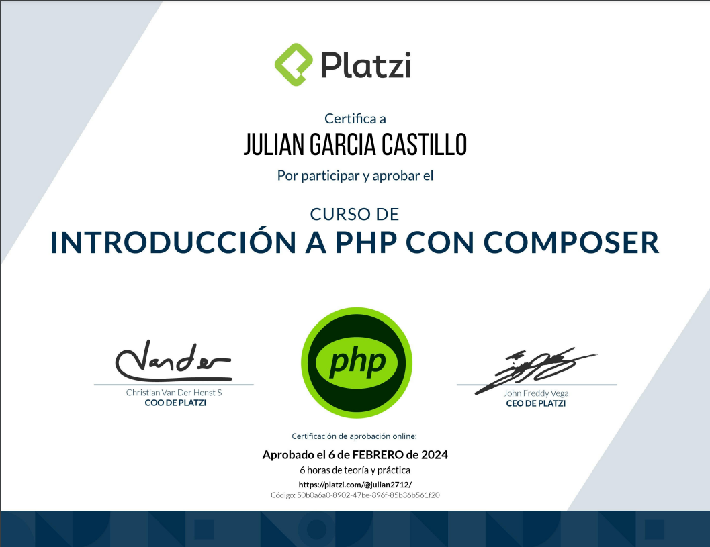

## Ruta PHP
### Curso 5

# Descripción
PHP es un lenguaje de programación web del lado del servidor, presente en el 80% de sitios como Facebook y Wikipedia. Aprenderás lo esencial para comenzar con bases sólidas, conocerás sus partes más importantes e iniciarás tu primer proyecto con Composer.
